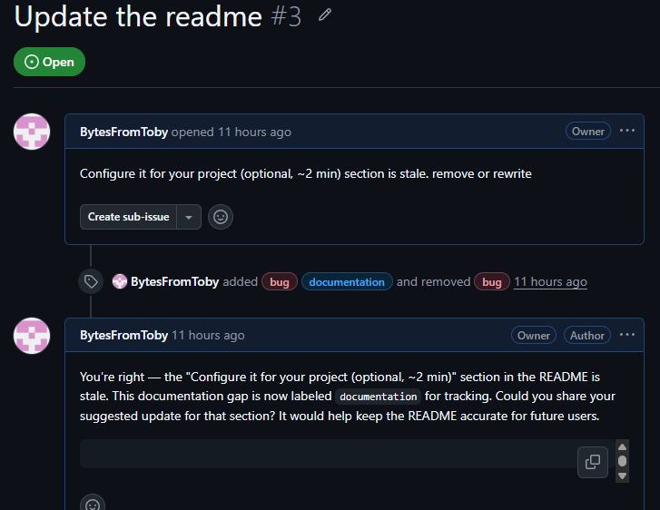

# RepoRouter

**An AI operator that triages GitHub issues end-to-end — designed to run safely on small, local models.** Point it at a repo and it fetches every new issue, makes the call, and posts the result — labeled reply, close, or private escalation — checking each issue against the project's own docs first. It decides and acts. It does not hand the question back.

Three ways to run it: **GitHub Actions** (the repo triages its own issues — the workflow ships in this repo), **local CLI** (`triage.py`), or **manual** (paste an issue into the browser UI or any AI chat for a one-off draft).



## How it works

Two small LLM calls per issue, with the dangerous decisions taken away from the model:

```
full issue ─► CALL 1: categorize ─► harness short-circuits:
                                      security/hostile ─► private escalation (LLM never drafts these)
                                      spam ─► close with a canned reply
                                      noise ─► no action
                                      │
                              everything else
                                      ▼
              fetch ONLY the docs relevant to that category
                                      ▼
              CALL 2: decide ─► confirm-or-flip against the docs ─► ONE of:
                  RESPOND + LABEL  ·  CLOSE  ·  ESCALATE (private, with a recommendation)
                                      ▼
              harness validates before posting: parseable route, clean draft,
              whitelisted labels — anything malformed becomes an escalation
```

Every issue gets: a category, which docs were checked, a route, labels (added, never stripped), a priority for confirmed bugs, and a finished draft — or a private escalation brief that ends with a recommendation, never a blank question.

## Built for small models

RepoRouter's default deployment is an 8B model on a local Ollama — so the architecture assumes the model *will* sometimes get the format wrong, and makes that safe:

- **Two scoped calls, not one mega-prompt.** A tiny classification call, then a decision call carrying only the docs that category needs. Small models do markedly better with less to hold.
- **The harness enforces the hard rules, not the prompt.** Security and hostile issues are short-circuited in code — no model output can post, label, or acknowledge them publicly. Labels are whitelisted to GitHub's nine standard names; invented labels are dropped, never created.
- **Parse failure can never publish model internals.** No parseable draft → no post — the issue escalates to a human instead. Chain-of-thought (`<think>` blocks) is stripped before parsing, and a draft that still contains pipeline metadata is rejected.
- **Existing labels are never stripped** — labels are added via the additive API, and a model "removing" a label has no effect.
- **Temperature 0 everywhere**, and the decision prompt tells the model exactly what the parser accepts.

## Quickstart — GitHub Actions

The workflow is included at `.github/workflows/triage.yml`. It fires on `issues: opened/reopened`, a 30-minute cron, and manual dispatch. `GITHUB_TOKEN` is injected automatically — you never set it.

**Self-hosted runner (default):** the runner machine needs Python 3.11+ on PATH and Ollama running with the model pulled (`ollama pull qwen3:8b`). Nothing else.

**GitHub-hosted runner:** change `runs-on` to `ubuntu-latest` and uncomment the Ollama install step in the workflow (~2 minutes added per run). Or switch the provider: add `ANTHROPIC_API_KEY` under Settings → Secrets → Actions and drop the `--provider ollama --model qwen3:8b` flags from the run line.

Escalations (security reports, calls the docs can't settle) appear in the **run's step summary** and as a `followup` artifact — they are never posted to the issue.

## Quickstart — Local CLI

```bash
pip install -r requirements.txt

# credentials: copy .env.example to .env, or export directly
export GITHUB_TOKEN=ghp_...
export ANTHROPIC_API_KEY=sk-ant-...   # only for --provider anthropic

# triage every unhandled open issue
python triage.py owner/your-repo

# local model instead (default model: qwen3:8b)
python triage.py owner/your-repo --provider ollama

# preview every decision without touching GitHub
python triage.py owner/your-repo --dry-run

# one issue / recent issues only / continuous
python triage.py owner/your-repo --issue 42
python triage.py owner/your-repo --since 2026-06-01
python triage.py owner/your-repo --interval 30
```

Each run finds every open issue the operator hasn't commented on, runs the pipeline, posts labels/replies/closes as appropriate, and writes escalations to `GithubIssues/followup.md` plus a per-issue JSON log in `GithubIssues/IssueLog/`.

**Browser UI:** `python chat.py` → http://localhost:5000 — paste a single issue for an instant draft-only decision, or run a live repo triage and watch each decision stream in.

## Quickstart — Manual mode (one-off drafts)

Use this to triage a single issue in any AI chat session without running any code.

**Step 1 — Orient the model.** Paste this prompt once at the start of a session:

```text
You are RepoRouter, an issue-triage operator. Read identity.md and rules.md and follow
them exactly. Locate this repo's docs (spec, roadmap, changelog, README) so you have
ground truth to check against. When I paste a GitHub issue, run it through your pipeline
and return ONE decision — respond+label, close, or escalate — with the labels and a
finished draft. Draft only; never post. Reply "ready" and I'll paste the first issue.
```

If your repo has a `CLAUDE.md`, add this block to it instead so the operator loads automatically:

```markdown
## Issue triage — RepoRouter
When I paste a GitHub issue (or say "triage this"), act as the operator in `RepoRouter/`:
read `identity.md` and `rules.md`, then run the issue through the pipeline.
Check claims against this repo's own docs. Draft only — never post.
```

**Step 2 — Triage.** Paste a GitHub issue — **the whole block**, not just the title (author, role, body, existing labels, activity log). Say *"triage this."* You get back one decision, ready to act on.

## What makes it trustworthy

- **It checks against your docs, not vibes.** A "bug" that the spec says is intended gets closed correctly; a feature on the roadmap gets the right holding reply. Doc discovery is case-insensitive and reads your repo's actual layout (root + `docs/`).
- **It branches on author role.** GitHub's `author_association` is read for every issue — an issue filed by the repo Owner is treated as an internal note, not answered like an external ticket.
- **It never guesses.** If the docs are silent on the behavior, it escalates with the open question spelled out instead of inventing a spec citation.
- **It handles security structurally.** Security reports short-circuit in code before any LLM drafting — escalated privately, unlabeled, never confirmed or discussed in public. See `reference/security-handling.md`.
- **Its safety layer is tested.** The parser, validators, and guardrails are pinned by a pytest suite (`python -m pytest tests/ -q`) — no network or LLM required.

## What's in the repo

```
RepoRouter/
├── triage.py              Core pipeline + CLI (also imported by chat.py)
├── chat.py                Browser UI — paste issues or triage a repo live
├── tests/                 Pytest suite for the parser, validators, and guardrails
├── requirements.txt       Python deps (anthropic, PyGithub, flask, requests)
├── .env.example           Credential template (copy to .env, never commit it)
├── .github/workflows/     The self-triage Actions workflow
├── identity.md            Operator scope and limits
├── rules.md               The decision pipeline — the heart
├── examples.md            Five worked decisions, including edge cases
├── GithubIssues/          Run output (gitignored): followup.md + per-issue JSON logs
├── docs/
│   ├── SPEC.md            Full technical specification
│   ├── ROADMAP.md         Planned milestones and non-goals
│   └── CHANGELOG.md       Version history
└── reference/
    ├── label-taxonomy.md      Routing → GitHub's nine standard labels
    ├── triage-rubric.md       P0–P3 priority scoring for confirmed bugs
    ├── response-templates.md  Voice-matched draft scaffolds per route
    ├── security-handling.md   Absolute rules for vulnerability reports
    └── sample-project/        Demo repo (Log_breakdown) for immediate testing
```

## Limits (by design)

In automated mode it posts replies, applies labels, and closes issues — but it never claims a bug is "reproduced" or "fixed" (it cannot run your code). It is only as good as your docs: where the spec is stale or silent, it escalates rather than guesses. Security reports are never posted publicly — always escalated privately, and that rule is enforced by the harness, not by the model's good behavior.

In manual mode it drafts only; you review before touching GitHub.
