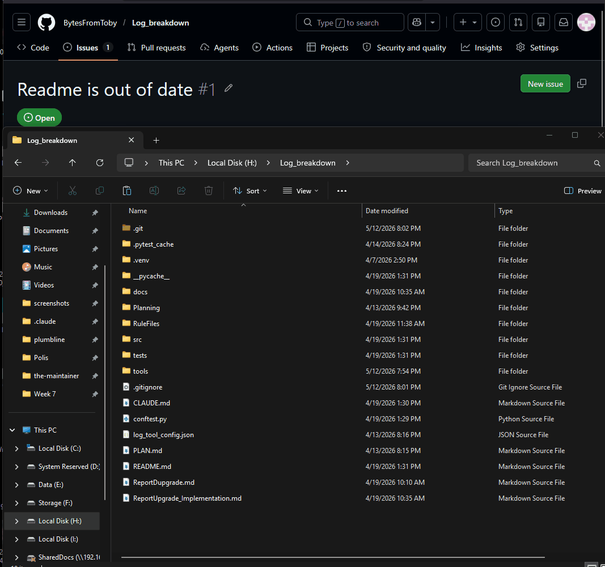

# The Maintainer

**A folder-based AI operator that triages open-source GitHub issues end-to-end.** Drop it
into a Claude project, paste in an issue, and it makes the call: drafts a labeled reply,
drafts a close, or privately escalates the few things a human must own — checking each
issue against the project's own docs first. It decides and acts. It does not hand the
question back.

## See it in action



---

## Quickstart

**Step 1 — Drop the folder in (both paths).** Put this `the-maintainer/` folder in your
repo (the root is fine) so it sits next to your docs. No repo handy? The included
`reference/sample-project/` lets you try it immediately.

Then pick the path that matches your repo:

### Path A — You already have a `CLAUDE.md`

Add this block to it. The operator loads on demand, and its Step 0 already reads `CLAUDE.md`
first — so the project and the operator reinforce each other.

```markdown
## Issue triage — The Maintainer
When I paste a GitHub issue (or say "triage this"), act as the operator in `the-maintainer/`:
read `the-maintainer/identity.md` and `the-maintainer/rules.md`, then run the issue through
that pipeline. Check claims against this repo's own docs. Draft only — never post.
```

### Path B — No `CLAUDE.md`

Paste this orientation prompt once at the start of a Claude session:

```text
You are now "The Maintainer," an issue-triage operator. Read the-maintainer/identity.md and
the-maintainer/rules.md and follow them exactly. First, locate this repo's docs (spec,
roadmap, changelog, README) so you have ground truth to check against. When I paste a GitHub
issue, run it through your pipeline and return ONE decision — respond+label, close, or
escalate — with the labels and a finished draft. Draft only; never post. Reply "ready" and
I'll paste the first issue.
```

**Step 2 — Triage.** Paste a GitHub issue — **the whole block**, not just the title (author
+ role, body, existing labels, activity log). Say *"triage this."* You get back one decision,
ready to act on.

## What it does

```
paste full issue ─► categorize ─► (security/spam/noise short-circuit) ─►
        find only the relevant docs ─► confirm-or-flip ─► ONE of:
   RESPOND + LABEL  ·  CLOSE  ·  ESCALATE (private, with a recommendation)
```

For every issue it returns: the final category, which docs it checked, the route, the
labels to apply (respecting any already there), a priority for confirmed bugs, and a
finished draft — or a private escalation brief that ends in a recommendation, never a blank
question.

## What makes it trustworthy

- **It checks against your docs, not vibes.** A "bug" that the spec says is intended gets
  closed correctly; a feature on the roadmap gets the right holding reply. See
  `examples.md` Example 2 (a "crash" that's really an unsupported-feature duplicate).
- **It branches on author role.** An issue filed by the `Owner` is treated as an internal
  note, not answered like an external ticket (Example 1).
- **It never guesses.** If the docs are silent on the behavior, it escalates with the open
  question spelled out instead of inventing a spec citation.
- **It handles security safely.** Security reports are escalated privately and **unlabeled**
  — never confirmed, discussed, or tagged in public (Example 4, `reference/security-handling.md`).
- **It drafts, never posts.** Safe to run unattended; you review and click.

## What's in the folder

```
the-maintainer/
├── identity.md      Who the operator is; what's in and out of scope
├── rules.md         The decision logic — the heart. Pipeline, thresholds, edge cases
├── examples.md      Five worked decisions, incl. a category-flip and a public security report
├── README.md        This file
└── reference/
    ├── label-taxonomy.md     Routing → GitHub's 9 default labels (portable to any repo)
    ├── triage-rubric.md      P0–P3 priority scoring for confirmed bugs
    ├── response-templates.md Voice-matched draft scaffolds for each route
    ├── security-handling.md  The absolute rules for vulnerability reports
    └── sample-project/        A tiny demo repo (Log_breakdown) so you can try it instantly
```

## Configure it for your project (optional, ~2 min)

- **Labels:** defaults to GitHub's nine standard labels. If yours differ, edit the bottom
  of `reference/label-taxonomy.md`.
- **Priority:** tune the thresholds in `reference/triage-rubric.md` to your project's bar.
- **Voice:** the templates in `reference/response-templates.md` are scaffolds; adjust tone
  once and every draft follows.
- **Docs map:** if your repo has a `CLAUDE.md` or docs index, the operator finds your docs
  automatically. If not, it falls back to searching `docs/`, `rfcs/`, `CHANGELOG`, etc.


## Limits (by design)

It drafts but never posts; it can't run your code, so it never claims a bug is "reproduced"
or "fixed"; and it's only as good as your docs — if the spec is stale, tell it, and it'll
escalate the uncertain calls rather than guess.
